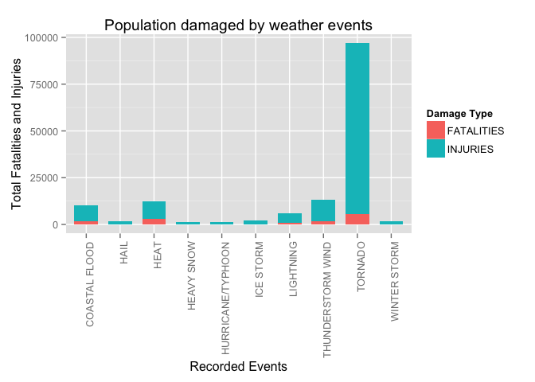
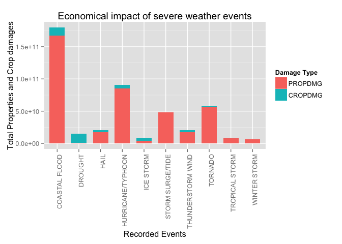

# Impact of severe weather events from 1950 to 2011 in USA
Antonio Fernandez Vara  
21 Mar 2015  

## Synopsis

Every year weather effects caused a significant amount of economic problems for communities and municipalities. The purpose of this anylysis was to calculate the damages for every type of weather event recorded for the years 1950 to 2011. All data for this analysis was obtained from the U.S. National Oceanic and Atmospheric Administration's storm database. This tracks events of mayour storms and weather events in the United States, with the time when they occur and an estimation of any fatalities, injuries and property damage.


## Data Processing

### Environment basic settings


```r
library(ggplot2)
library(xtable)
library(reshape2)
library(gridExtra)
```

```
## Loading required package: grid
```

### Obtaining data

This part of data processing focus on the download and extraction of the data to be able to replicate the analysis.

Data URL: https://d396qusza40orc.cloudfront.net/repdata%2Fdata%2FStormData.csv.bz2

The data is in CSV format compressed using bzip2.


```r
if (!file.exists('StormData.csv.bz2')) {
  url <- 'https://d396qusza40orc.cloudfront.net/repdata%2Fdata%2FStormData.csv.bz2'
  filename <- 'StormData.csv.bz2'
  download.file(url, filename, method = 'curl')
}

if (!exists("storm.data")) {
  storm.data <- read.csv( bzfile('StormData.csv.bz2') )
}

if (!exists("raw.data")) {
  raw.data <- storm.data
}
```

Data must have 902297 observations (rows) of 37 variables (columns).


```r
dim(storm.data)
```

```
## [1] 902297     37
```

Quick look of data


```r
head(storm.data)
```

```
##   STATE__           BGN_DATE BGN_TIME TIME_ZONE COUNTY COUNTYNAME STATE
## 1       1  4/18/1950 0:00:00     0130       CST     97     MOBILE    AL
## 2       1  4/18/1950 0:00:00     0145       CST      3    BALDWIN    AL
## 3       1  2/20/1951 0:00:00     1600       CST     57    FAYETTE    AL
## 4       1   6/8/1951 0:00:00     0900       CST     89    MADISON    AL
## 5       1 11/15/1951 0:00:00     1500       CST     43    CULLMAN    AL
## 6       1 11/15/1951 0:00:00     2000       CST     77 LAUDERDALE    AL
##    EVTYPE BGN_RANGE BGN_AZI BGN_LOCATI END_DATE END_TIME COUNTY_END
## 1 TORNADO         0                                               0
## 2 TORNADO         0                                               0
## 3 TORNADO         0                                               0
## 4 TORNADO         0                                               0
## 5 TORNADO         0                                               0
## 6 TORNADO         0                                               0
##   COUNTYENDN END_RANGE END_AZI END_LOCATI LENGTH WIDTH F MAG FATALITIES
## 1         NA         0                      14.0   100 3   0          0
## 2         NA         0                       2.0   150 2   0          0
## 3         NA         0                       0.1   123 2   0          0
## 4         NA         0                       0.0   100 2   0          0
## 5         NA         0                       0.0   150 2   0          0
## 6         NA         0                       1.5   177 2   0          0
##   INJURIES PROPDMG PROPDMGEXP CROPDMG CROPDMGEXP WFO STATEOFFIC ZONENAMES
## 1       15    25.0          K       0                                    
## 2        0     2.5          K       0                                    
## 3        2    25.0          K       0                                    
## 4        2     2.5          K       0                                    
## 5        2     2.5          K       0                                    
## 6        6     2.5          K       0                                    
##   LATITUDE LONGITUDE LATITUDE_E LONGITUDE_ REMARKS REFNUM
## 1     3040      8812       3051       8806              1
## 2     3042      8755          0          0              2
## 3     3340      8742          0          0              3
## 4     3458      8626          0          0              4
## 5     3412      8642          0          0              5
## 6     3450      8748          0          0              6
```

### Cleaning data

Most important column to help categorize correctly the data is EVTYPE, but there are many different patterns for the same weather event. [Storm Database Documentation PDF](https://d396qusza40orc.cloudfront.net/repdata%2Fpeer2_doc%2Fpd01016005curr.pdf) contains the documentation used to recategorizate to normalized events.

There are 985 different events recorded while the documentation of the database separate them into 48, so it needs to be cleaned and categorized using pattern matching. There are issues on how is labeled the data. 

NOTE: *Only significant events categories were cleaned, there are a more fine grane categorization to make still.*


```r
length(unique(storm.data$EVTYPE))
```

```
## [1] 985
```

To simplificate searchs, event type data is converted to capitals.


```r
storm.data$EVTYPE <- toupper(as.character(storm.data$EVTYPE))
```

Normalizing data by pattern matching. Fixing some mispelled labels.


```r
storm.data[grep("ASTRONOMICAL", storm.data$EVTYPE),"EVTYPE"] <- "ASTRONOMICAL LOW TIDE"
storm.data[grep("AVALANCE|AVALANCHE", storm.data$EVTYPE),"EVTYPE"] <- "AVALANCHE"
storm.data[grep("BLIZZARD", storm.data$EVTYPE),"EVTYPE"] <- "BLIZZARD"
storm.data[grep("FLOOD|FLD|DROWNING|HIGH WATER|RISING WATER", storm.data$EVTYPE),"EVTYPE"] <- "COASTAL FLOOD"
storm.data[grep("COLD WIND CHILL|COLD/WIND CHILL|COLD/WINDS", storm.data$EVTYPE),"EVTYPE"] <- "COLD/WIND CHILL"
storm.data[grep("DEBRIS FLOW", storm.data$EVTYPE),"EVTYPE"] <- "DEBRIS FLOW"
storm.data[grep("FOG", storm.data$EVTYPE),"EVTYPE"] <- "DENSE FOG"
storm.data[grep("SMOKE", storm.data$EVTYPE),"EVTYPE"] <- "DENSE SMOKE"
storm.data[grep("DROUGHT|DRY", storm.data$EVTYPE),"EVTYPE"] <- "DROUGHT"
storm.data[grep("DUST DEVIL", storm.data$EVTYPE),"EVTYPE"] <- "DUST DEVIL"
storm.data[grep("DUST STORM", storm.data$EVTYPE),"EVTYPE"] <- "DUST STORM"
storm.data[grep("HEAT WAVE|EXCESSIVE HEAT|EXTREME HEAT|HEAT|WARM WEATHER", storm.data$EVTYPE),"EVTYPE"] <- "EXCESSIVE HEAT"
storm.data[grep("COLD|HYPOTHERMIA|LOW TEMPERATURE|EXPOSURE", storm.data$EVTYPE),"EVTYPE"] <- "EXTREME COLD/WIND CHILL"
storm.data[grep("FLASH FLOOD|FLOOD FLASH", storm.data$EVTYPE),"EVTYPE"] <- "FLASH FLOOD"
storm.data[grep("^FLOOD|FLD|DROWNING|HIGH WATER|RISING WATER", storm.data$EVTYPE),"EVTYPE"] <- "FLOOD"
storm.data[grep("^FROST|^FREEZE", storm.data$EVTYPE),"EVTYPE"] <- "FROST/FREEZE"
storm.data[grep("FUNNEL", storm.data$EVTYPE),"EVTYPE"] <- "FUNNEL CLOUD"
storm.data[grep("HAIL", storm.data$EVTYPE),"EVTYPE"] <- "HAIL"
storm.data[grep("HEAT|HIGH TEMPERATURE", storm.data$EVTYPE),"EVTYPE"] <- "HEAT"
storm.data[grep("RAIN|WET", storm.data$EVTYPE),"EVTYPE"] <- "HEAVY RAIN"
storm.data[grep("SNOW", storm.data$EVTYPE),"EVTYPE"] <- "HEAVY SNOW"
storm.data[grep("HIGH SURF", storm.data$EVTYPE),"EVTYPE"] <- "HIGH SURF"
storm.data[grep("HIGH WIND", storm.data$EVTYPE),"EVTYPE"] <- "HIGH WIND"
storm.data[grep("HURRICANE|TYPHOON", storm.data$EVTYPE),"EVTYPE"] <- "HURRICANE/TYPHOON"
storm.data[grep("ICE STORM|ICESTORM", storm.data$EVTYPE),"EVTYPE"] <- "ICE STORM"
storm.data[grep("LAKESHORE FLOOD|LAKE FLOOD", storm.data$EVTYPE),"EVTYPE"] <- "LAKESHORE FLOOD"
storm.data[grep("LAKE EFFECT SNOW|LAKE-EFFECT SNOW", storm.data$EVTYPE),"EVTYPE"] <- "LAKE-EFFECT SNOW"
storm.data[grep("LIGHTNING", storm.data$EVTYPE),"EVTYPE"] <- "LIGHTNING"
storm.data[grep("MARINE HAIL", storm.data$EVTYPE),"EVTYPE"] <- "MARINE HAIL"
storm.data[grep("MARINE HIGH WIND|MARINE STRONG WIND", storm.data$EVTYPE),"EVTYPE"] <- "MARINE HIGH WIND"
storm.data[grep("MARINE THUNDERSTORM WIND|MARINE TSTM WIND", storm.data$EVTYPE),"EVTYPE"] <- "MARINE THUNDERSTORM WIND"
storm.data[grep("RIP CURRENT", storm.data$EVTYPE),"EVTYPE"] <- "RIP CURRENT"
storm.data[grep("SEICHE", storm.data$EVTYPE),"EVTYPE"] <- "SEICHE"
storm.data[grep("SLEET", storm.data$EVTYPE),"EVTYPE"] <- "SLEET"
storm.data[grep("STORM SURGE", storm.data$EVTYPE),"EVTYPE"] <- "STORM SURGE/TIDE"
storm.data[grep("STRONG WIND|EXTREME WIND", storm.data$EVTYPE),"EVTYPE"] <- "STRONG WIND"
storm.data[grep("THUNDERSTORM|THUNDESTORM|THUNERSTORM|THUNDEERSTORM|THUNDEERSTORM|THUNDERTSORM|TSTM|TSTMW|WIND", storm.data$EVTYPE),"EVTYPE"] <- "THUNDERSTORM WIND"
storm.data[grep("TORNADO", storm.data$EVTYPE),"EVTYPE"] <- "TORNADO"
storm.data[grep("TROPICAL DEPRESSION", storm.data$EVTYPE),"EVTYPE"] <- "TROPICAL DEPRESSION"
storm.data[grep("TROPICAL STORM", storm.data$EVTYPE),"EVTYPE"] <- "TROPICAL STORM"
storm.data[grep("TSUNAMI", storm.data$EVTYPE),"EVTYPE"] <- "TSUNAMI"
storm.data[grep("VOLCANIC", storm.data$EVTYPE),"EVTYPE"] <- "VOLCANIC ASH"
storm.data[grep("WATERSPROUT|WATER SPROUT|WAYTERSPOUT", storm.data$EVTYPE),"EVTYPE"] <- "WATERSPROUT"
storm.data[grep("WILDFIRE|WILD FIRE", storm.data$EVTYPE),"EVTYPE"] <- "WILDFIRE"
storm.data[grep("WINTER STORM", storm.data$EVTYPE),"EVTYPE"] <- "WINTER STORM"
storm.data[grep("WINTER WEATHER|WINTRY|WINTERY", storm.data$EVTYPE),"EVTYPE"] <- "WINTER WEATHER"
```

### Filtered data

#### Creating a simpler dataset

For the calculations we need two subsets of the data we need to get our results. Also it calculates corrected economical damages using the exponential character as stated on the dataset documentation.

It takes three steps:

1. Calculate property damage corrected values using exponential column. It ignores all non documented exponents.


```r
dataset <- storm.data[, c("EVTYPE", "FATALITIES", "INJURIES", "PROPDMG", "PROPDMGEXP", "CROPDMG", "CROPDMGEXP")]

for(i in 1:length(dataset$PROPDMG)){
    if(dataset$PROPDMGEXP[i] == "K" | dataset$PROPDMGEXP[i] == "k"){
        dataset$PROPDMG[i] <- dataset$PROPDMG[i] * 1000
    }
    if(dataset$PROPDMGEXP[i] == "M" | dataset$PROPDMGEXP[i] == "m"){
        dataset$PROPDMG[i] <- storm.data$PROPDMG[i] * 1000000
    }
    if(dataset$PROPDMGEXP[i] == "B" | dataset$PROPDMGEXP[i] == "b"){
        dataset$PROPDMG[i] <- dataset$PROPDMG[i] * 1000000000
    }
}
```

2. Calculate crop damage corrected values using exponential column. It ignores all non documented exponents.


```r
for(i in 1:length(dataset$CROPDMG)){
    if(dataset$CROPDMGEXP[i] == "K" | dataset$CROPDMGEXP[i] == "k"){
        dataset$CROPDMG[i] <- dataset$CROPDMG[i] * 1000
    }
    if(dataset$CROPDMGEXP[i] == "M" | dataset$CROPDMGEXP[i] == "m"){
        dataset$CROPDMG[i] <- dataset$CROPDMG[i] * 1000000
    }
    if(dataset$CROPDMGEXP[i] == "B" | dataset$CROPDMGEXP[i] == "b"){
        dataset$CROPDMG[i] <- dataset$CROPDMG[i] * 1000000000
    }
}
```

3. Data for results with totals.


```r
dataset.population <- dataset[, c("EVTYPE", "FATALITIES", "INJURIES")]
dataset.population <- melt(dataset.population, id = c("EVTYPE"))

dataset.economical <- dataset[, c("EVTYPE", "PROPDMG", "CROPDMG")]
dataset.economical <- melt(dataset.economical, id = c("EVTYPE"))
```


#### Most harmful with respect to population health.

Calculation of totals and sort by TOTAL column.


```r
dataset.population.damages <- dcast(dataset.population, EVTYPE ~ variable, sum)
dataset.population.damages$TOTAL <- rowSums(dataset.population.damages[, c("FATALITIES", "INJURIES")])
dataset.population.damages <- dataset.population.damages[order( -dataset.population.damages[,4] ), ]
```


#### Most economical damage totals.

Calculation of totals and sort by TOTAL column.


```r
dataset.economical.damages <- dcast(dataset.economical, EVTYPE ~ variable, sum)
dataset.economical.damages$TOTAL <- rowSums(dataset.economical.damages[, c("PROPDMG", "CROPDMG")])
dataset.economical.damages <- dataset.economical.damages[order( -dataset.economical.damages[,4] ), ]
```


## Results

### Most Harmful types of events with respect to population health.

The most harmful events are in order tornados, thunderstorm winds and heat. Tornados the most harmful event for both fatalities and injuries.

The table below shows the top 10 events that have the greatest impact on population health.


```r
  head(dataset.population.damages, n=10)
```

```
##                EVTYPE FATALITIES INJURIES TOTAL
## 211           TORNADO       5636    91407 97043
## 210 THUNDERSTORM WIND       1661    11676 13337
## 56               HEAT       3132     9211 12343
## 19      COASTAL FLOOD       1558     8683 10241
## 93          LIGHTNING        817     5232  6049
## 84          ICE STORM         89     1990  2079
## 243      WINTER STORM        216     1338  1554
## 53               HAIL         45     1467  1512
## 77  HURRICANE/TYPHOON        133     1333  1466
## 64         HEAVY SNOW        149     1163  1312
```

Plot with those values.


```r
  ggplot(melt(head(dataset.population.damages[,c(1:3)], n=10)), 
          aes(x = EVTYPE, y = value, fill = variable)) +
          geom_bar(stat="identity", width = 0.7) +
          xlab("Recorded Events") + 
          ylab("Total Fatalities and Injuries") +
          ggtitle("Population damaged by weather events") +
          scale_fill_hue(name = "Damage Type") + 
          theme(axis.text.x = element_text(angle = 90, hjust = 1))
```

```
## Using EVTYPE as id variables
```

 

## Most economical impact on property and crop damage.

The most impacting events globally are coastal floods, hurricanes and tornados. Properties are impacted by the action of coastal flood, while crops get affected by drought mainly.

The table below shows the top 10 events that have the greatest impact on property, crop and global damage.


```r
  head(dataset.economical.damages, n=10)
```

```
##                EVTYPE      PROPDMG     CROPDMG        TOTAL
## 19      COASTAL FLOOD 167588555582 12388597200 179977152782
## 77  HURRICANE/TYPHOON  85256410010  5506117800  90762527810
## 211           TORNADO  56993097979   414961470  57408059449
## 142  STORM SURGE/TIDE  47964724000      855000  47965579000
## 210 THUNDERSTORM WIND  17414068527  3405934688  20820003215
## 53               HAIL  17619991072  3114212873  20734203945
## 31            DROUGHT   1053038600 13972636780  15025675380
## 84          ICE STORM   3945427860  5022113500   8967541360
## 214    TROPICAL STORM   7714390550   694896000   8409286550
## 243      WINTER STORM   6688997251    27444000   6716441251
```

Plot showing the values.


```r
  ggplot(melt(head(dataset.economical.damages[,c(1:3)], n=10)), 
          aes(x = EVTYPE, y = value, fill = variable)) +
          geom_bar(stat="identity", width = 0.7) +
          xlab("Recorded Events") + 
          ylab("Total Properties and Crop damages") +
          ggtitle("Economical impact of severe weather events") +
          scale_fill_hue(name = "Damage Type") + 
          theme(axis.text.x = element_text(angle = 90, hjust = 1))
```

```
## Using EVTYPE as id variables
```

 
